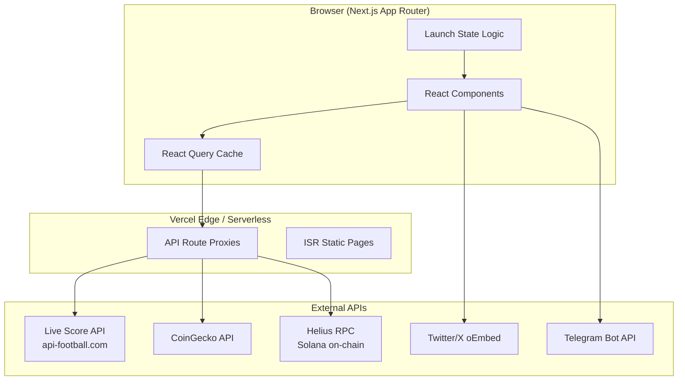
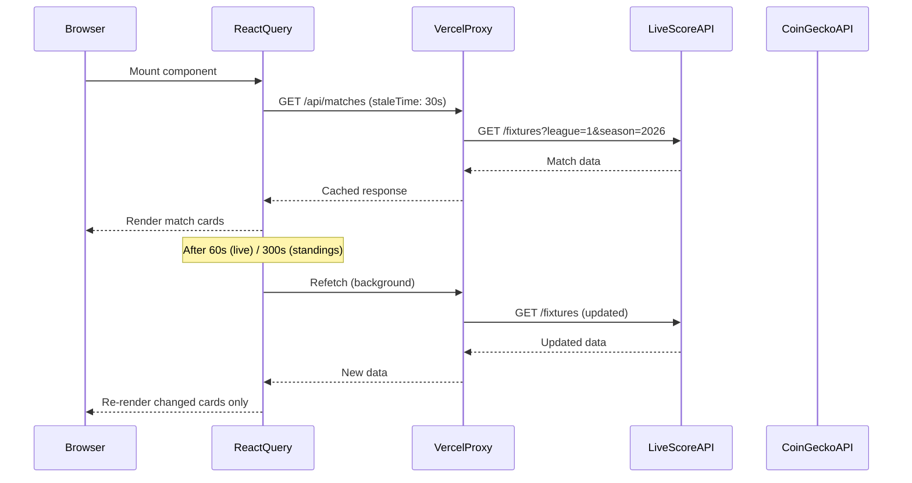
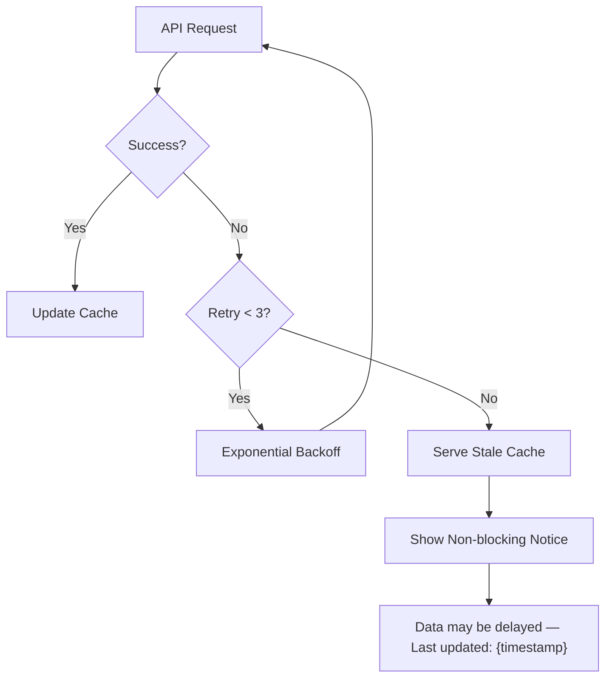

# Design Document

## Overview

$WCBLIVE (WorldCupBetLive) is a World Cup 2026 community prediction platform built on the Solana blockchain, powered by a memecoin token launched on Pump.fun. The website is a hype machine designed to capture World Cup 2026 euphoria and convert it into organic token buying momentum. It presents as a professional betting/prediction platform while all prediction features remain "Coming Soon" until June 11, 2026.

The platform is built with Next.js 14 (App Router), TypeScript, Tailwind CSS, Framer Motion, and React Query, hosted on Vercel. The Solana/Pump.fun identity is prominent throughout every section.

### Platform Phases

| Phase | Dates | Focus |
|-------|-------|-------|
| Pre-launch | Now — May 20, 2026 | Website live, all predictions "Coming Soon", token awareness |
| Whitelist | May 20 — June 1, 2026 | NFT whitelist opens, early adopter leaderboard activates |
| NFT & Beta | June 1 — June 11, 2026 | NFT drop, staking preview, beta access for top holders |
| Live | June 11, 2026+ | World Cup kickoff, predictions open, full platform active |

### Key Design Principles

1. **Solana/Pump.fun identity is non-negotiable** — Solana gradient, Pump.fun branding, and "$WCBLIVE" ticker appear throughout every section.
2. **Every dead-end redirects to Pump.fun** — All "Coming Soon" interactions funnel users to buy $WCBLIVE.
3. **Data must be convincing** — All 48 teams, 12 groups, live scores, standings, and player stats create a credible sports platform.
4. **FOMO-driven UX** — Countdown timers, milestone trackers, and leaderboards create urgency.

---

## Architecture

### Tech Stack

| Layer | Technology | Purpose |
|-------|-----------|---------|
| Framework | Next.js 14 (App Router) | SSR, routing, image optimization, Edge Runtime |
| Language | TypeScript 5 | Type safety across all components and API layers |
| Styling | Tailwind CSS + custom Solana palette | Utility-first styling with brand colors |
| Animation | Framer Motion 11 | Page transitions, countdown flips, celebration effects |
| Data Fetching | TanStack Query v5 (React Query) | Caching, polling, retry logic for all API calls |
| Hosting | Vercel (Edge Runtime for API routes) | Global CDN, serverless functions, preview deployments |
| Fonts | Inter + Space Grotesk (Google Fonts) | Bold, impactful typography |

### Color Palette

```css
/* Solana Gradient */
--solana-purple: #9945FF;
--solana-green: #14F195;

/* Background */
--bg-primary: #0a0e1a;
--bg-secondary: #0f1629;
--bg-card: rgba(255, 255, 255, 0.04);

/* Accents */
--gold: #FFD700;
--gold-muted: #B8860B;

/* Status */
--live-green: #00FF88;
--error-red: #FF4444;
--text-primary: #FFFFFF;
--text-secondary: #8892A4;
```

### High-Level Architecture



### Data Flow



### Project Structure

```
src/
  app/
    layout.tsx              # Root layout: Navbar + TickerBar + Footer
    page.tsx                # Single-page app: all sections stacked
    globals.css             # Tailwind base + custom CSS variables
    api/
      matches/route.ts      # Proxy: Live Score API /fixtures
      standings/route.ts    # Proxy: Live Score API /standings
      topscorers/route.ts   # Proxy: Live Score API /players/topscorers
      token/route.ts        # Proxy: CoinGecko + Helius
      leaderboard/route.ts  # Proxy: Helius token holders
  components/
    layout/
      Navbar.tsx            # Sticky nav with Solana badge + Connect Wallet
      Footer.tsx            # Pump.fun + Solana logos + links
      TickerBar.tsx         # Scrolling "$WCBLIVE • SOLANA • PUMP.FUN •" bar
    hero/
      HeroSection.tsx       # Full-viewport hero with headline + CTAs
      CountdownTimer.tsx    # Animated flip countdown to June 11, 2026
    matches/
      MatchCenter.tsx       # Section container with filter tabs
      MatchCard.tsx         # Individual match card with predict button
      MatchFilter.tsx       # All / Live / Upcoming / Finished tabs
    groups/
      GroupExplorer.tsx     # 12-group grid container
      GroupCard.tsx         # Expandable group card with standings
      GroupStandingsTable.tsx # Mini standings table (P/W/D/L/GF/GA/GD/Pts)
    standings/
      StandingsSection.tsx  # Container for stats + bracket
      TopScorers.tsx        # Top scorers leaderboard
      KnockoutBracket.tsx   # Horizontal scrollable bracket R32→Final
      BracketNode.tsx       # Individual bracket slot with Predict button
    token/
      TokenSection.tsx      # Glass card with metrics + buy CTAs
      TokenMetrics.tsx      # Price / Market Cap / Holders / Burned grid
      NFTPreview.tsx        # NFT Pass preview card with countdown
      PumpFunBadge.tsx      # "Launched on Pump.fun 🚀" badge component
    leaderboard/
      LeaderboardSection.tsx # Container with pagination
      LeaderboardEntry.tsx  # Single row: rank + wallet + holdings + tier + badges
      TierBadge.tsx         # Bronze/Silver/Gold/Platinum badge
    milestones/
      MilestoneTracker.tsx  # Progress bars container
      MilestoneBar.tsx      # Individual animated progress bar
    community/
      CommunityWall.tsx     # Twitter + Telegram feeds container
      TwitterFeed.tsx       # Twitter/X embed with fallback
      TelegramFeed.tsx      # Telegram embed with fallback
    shared/
      ComingSoonModal.tsx   # Modal: countdown + Pump.fun CTA
      SolanaLogo.tsx        # Solana gradient logo SVG
      TeamFlag.tsx          # Country flag via flagcdn.com
      PriceDisplay.tsx      # Animated price with up/down flash
  lib/
    api/
      livescore.ts          # Live Score API client functions
      coingecko.ts          # CoinGecko API client functions
      helius.ts             # Helius RPC client functions
    hooks/
      useMatches.ts         # React Query hook for match data
      useStandings.ts       # React Query hook for group standings
      useTokenMetrics.ts    # React Query hook for token price/mcap
      useLeaderboard.ts     # React Query hook for holder rankings
      useLaunchState.ts     # Hook: returns "pre-launch" | "live"
    utils/
      formatters.ts         # formatPrice(), formatMarketCap(), formatWallet()
      launchState.ts        # getLaunchState(timestamp): "pre-launch" | "live"
      standings.ts          # computeStandings(matchResults[]): StandingsRow[]
      tiers.ts              # assignTier(holdings): Tier, assignBadges(wallet): Badge[]
    constants/
      worldcup2026.ts       # All 48 teams, 12 groups, static data
      milestones.ts         # Milestone targets and labels
  types/
    match.ts                # Match, MatchStatus, MatchCard types
    standings.ts            # StandingsRow, Group, KnockoutBracket types
    token.ts                # TokenMetrics, PriceChange types
    leaderboard.ts          # WalletEntry, Tier, Badge types
```

---

## Components and Interfaces

### Layout Components

#### `Navbar.tsx`

Sticky navigation bar with blur-on-scroll effect.

```
┌─────────────────────────────────────────────────────────────────────┐
│ ◎ $WCBLIVE  [Built on Solana]  Match Center  Groups  Standings      │
│             Token  Leaderboard  Community          [Connect Wallet] │
└─────────────────────────────────────────────────────────────────────┘
```

**Props:** None (reads launch state from `useLaunchState`)

**Behavior:**
- Sticky with `backdrop-blur` on scroll (Framer Motion scroll listener)
- "Connect Wallet" button triggers `ComingSoonModal` before June 11, 2026
- Hamburger menu on mobile (`< 768px`) with full-screen overlay
- Solana gradient logo + "◎ Built on Solana" chip always visible

#### `TickerBar.tsx`

Scrolling marquee below the navbar.

```
$WCBLIVE • SOLANA • PUMP.FUN • WORLD CUP 2026 • 48 TEAMS • JUNE 11 •
```

**Props:** `price?: string` (optional live price display)

**Behavior:** CSS `animation: marquee` infinite loop, pauses on hover.

#### `Footer.tsx`

```
┌─────────────────────────────────────────────────────────────────────┐
│  [Solana Logo] Powered by Solana    [Pump.fun Logo] Built on Pump.fun│
│  Contract: AbCd...XyZ1  [Copy]                                      │
│  © 2026 $WCBLIVE. Not financial advice. Community memecoin.         │
└─────────────────────────────────────────────────────────────────────┘
```

---

### Hero Section

#### `HeroSection.tsx`

Full-viewport section with immersive background.

```
┌─────────────────────────────────────────────────────────────────────┐
│  [Animated football + Solana particle background]                   │
│                                                                     │
│  🚀 Launched on Pump.fun                                            │
│                                                                     │
│  World Cup 2026. Live. On Solana.                                   │
│  Predict Everything.                                                │
│                                                                     │
│  Hold $WCBLIVE. Unlock the game. Win the cup.                       │
│                                                                     │
│  [  Buy $WCBLIVE  ]  [  Explore Matches  ]                          │
│                                                                     │
│  ┌──────────────────────────────────────────┐                       │
│  │  127  :  14  :  32  :  08               │                       │
│  │  DAYS   HRS   MIN   SEC                 │                       │
│  └──────────────────────────────────────────┘                       │
└─────────────────────────────────────────────────────────────────────┘
```

**Props:** None

**Key elements:**
- Background: CSS radial gradient + Framer Motion floating particles (football + Solana logo icons)
- "Launched on Pump.fun 🚀" badge: Pump.fun green pill badge
- Headline: `text-6xl font-black` with Solana gradient on "On Solana"
- "Buy $WCBLIVE" button: Solana gradient (`#9945FF → #14F195`), opens Pump.fun in new tab
- "Explore Matches" button: outlined, scrolls to `#match-center`
- `CountdownTimer` embedded below CTAs

#### `CountdownTimer.tsx`

Animated flip countdown component.

**Props:**
```typescript
interface CountdownTimerProps {
  targetDate: Date;           // June 11, 2026 00:00 UTC
  onComplete?: () => void;    // Callback when countdown reaches zero
  compact?: boolean;          // Compact mode for ComingSoonModal
}
```

**Behavior:**
- Updates every second via `setInterval`
- Number flip animation using Framer Motion `AnimatePresence` + `motion.div`
- When `targetDate` is reached: displays "Predictions Are Live!" with green glow
- Respects `prefers-reduced-motion`: disables flip animation, shows plain numbers

---

### Match Center

#### `MatchCenter.tsx`

Section container with filter tabs and match card grid.

**Props:** None (uses `useMatches` hook)

**Layout:**
```
┌─────────────────────────────────────────────────────────────────────┐
│  ⚽ MATCH CENTER                                                     │
│  [All] [🔴 Live] [Upcoming] [Finished]                              │
│                                                                     │
│  ┌──────────────┐ ┌──────────────┐ ┌──────────────┐               │
│  │  MatchCard   │ │  MatchCard   │ │  MatchCard   │               │
│  └──────────────┘ └──────────────┘ └──────────────┘               │
└─────────────────────────────────────────────────────────────────────┘
```

**Data:** `useMatches()` hook with 60s refetch interval for live matches, 300s otherwise.

#### `MatchCard.tsx`

Individual match card with glass morphism styling.

**Props:**
```typescript
interface MatchCardProps {
  match: Match;
  onPredictClick: () => void;
}
```

**Layout:**
```
┌──────────────────────────────────────────────────────┐
│  🇧🇷 Brazil          [LIVE 🔴]          Argentina 🇦🇷  │
│                      2 - 1                           │
│  Group C • MetLife Stadium • Jun 13, 3:00 PM EDT     │
│                  [ Predict ]                         │
└──────────────────────────────────────────────────────┘
```

**Status badge variants:**
- `UPCOMING`: gray badge, shows kickoff time
- `LIVE`: green pulsing badge (`animate-pulse`), shows current score in `text-3xl font-black`
- `FINISHED`: white/muted badge, shows final score
- `HALFTIME`: yellow badge

**Predict button:** Solana gradient, triggers `ComingSoonModal` before launch date.

---

### Group Explorer

#### `GroupCard.tsx`

Expandable group card with mini standings table.

**Props:**
```typescript
interface GroupCardProps {
  group: Group;
  isExpanded: boolean;
  onToggle: () => void;
}
```

**Layout (collapsed):**
```
┌──────────────────────────────────────────────────────┐
│  GROUP A  🇲🇽 🇰🇷 🇿🇦 🇨🇿                    [▼]      │
│  Pos  Team        P  W  D  L  GD  Pts               │
│   1   Mexico      0  0  0  0   0    0               │
│   2   South Korea 0  0  0  0   0    0               │
│   3   South Africa 0  0  0  0  0    0               │
│   4   Czechia     0  0  0  0   0    0               │
│                  [ Predict Group ]                   │
└──────────────────────────────────────────────────────┘
```

**Expand animation:** Framer Motion `AnimatePresence` with spring physics, reveals match schedule within the group.

**Qualified indicator:** Green checkmark + "QUALIFIED" badge on top 2 teams after group stage completes.

---

### Standings Section

#### `KnockoutBracket.tsx`

Horizontally scrollable bracket visualization.

**Layout:**
```
R32 (16 matches) → R16 (8 matches) → QF (4) → SF (2) → FINAL
```

Each `BracketNode` shows:
- Team flag + name (or "TBD")
- "Predict Winner" button → `ComingSoonModal`
- SVG connecting lines between rounds

**Props:**
```typescript
interface KnockoutBracketProps {
  bracket: BracketData;
}
```

---

### Token Section

#### `TokenSection.tsx`

Glass card with Solana gradient border, token metrics, and buy CTAs.

**Layout:**
```
┌─────────────────────────────────────────────────────────────────────┐
│  ◎ $WCBLIVE TOKEN                                                   │
│  "The official token of WorldCupBetLive. Hold to unlock..."         │
│                                                                     │
│  ┌──────────┐ ┌──────────┐ ┌──────────┐ ┌──────────┐             │
│  │  Price   │ │  Mkt Cap │ │ Holders  │ │  Burned  │             │
│  │ $0.00042 │ │  $420K   │ │  12,450  │ │  2.1B    │             │
│  │  ▲ 4.2%  │ │          │ │          │ │          │             │
│  └──────────┘ └──────────┘ └──────────┘ └──────────┘             │
│                                                                     │
│  [🚀 Buy $WCBLIVE on Pump.fun]  [⚡ Swap on Jupiter]               │
│                                                                     │
│  [Pump.fun Logo] Launched on Pump.fun  [Solana Logo] Built on Solana│
│                                                                     │
│  ┌──────────────────────────────────────────────────────────────┐  │
│  │  🏆 World Cup Prediction Pass NFT                            │  │
│  │  Drops June 1, 2026 — Hold $WCBLIVE for Whitelist           │  │
│  │  [Countdown: 14d 6h 22m]                                    │  │
│  └──────────────────────────────────────────────────────────────┘  │
└─────────────────────────────────────────────────────────────────────┘
```

**Price animation:** When price changes between polls, `PriceDisplay` flashes green (increase) or red (decrease) with a scale pulse using Framer Motion.

---

### Leaderboard

#### `LeaderboardSection.tsx`

Early adopters leaderboard with tier badges and achievement badges.

**Layout:**
```
┌─────────────────────────────────────────────────────────────────────┐
│  🏆 EARLY ADOPTERS LEADERBOARD                                      │
│                                                                     │
│  Rank  Wallet        Holdings      Tier      Badges                 │
│   1    AbCd...XyZ1   42,000,000   🥇 Plat   💎 🐦 🐋              │
│   2    EfGh...WvUt   18,500,000   🥇 Plat   🐋                    │
│   3    IjKl...StRq   9,800,000    🥈 Gold   💎                    │
│  ...                                                                │
│                    [Load More]                                      │
└─────────────────────────────────────────────────────────────────────┘
```

**Tier thresholds:**
| Tier | Min Holdings | Max Holdings | Color |
|------|-------------|-------------|-------|
| Bronze | 1 | 99,999 | `#CD7F32` |
| Silver | 100,000 | 999,999 | `#C0C0C0` |
| Gold | 1,000,000 | 9,999,999 | `#FFD700` |
| Platinum | 10,000,000 | ∞ | Solana gradient |

**Badge criteria:**
| Badge | Icon | Criteria |
|-------|------|---------|
| Diamond Hands | 💎 | Held continuously ≥ 30 days |
| Early Bird | 🐦 | Purchased on launch day |
| Whale | 🐋 | Holdings ≥ 10,000,000 tokens |

---

### Milestone Tracker

#### `MilestoneTracker.tsx`

Horizontal progress bars with glow effects.

**Milestones:**
| Milestone | Target | Data Source |
|-----------|--------|-------------|
| 10K Holders | 10,000 | Helius / CoinGecko |
| $1M Market Cap | $1,000,000 | CoinGecko |
| 5K Discord Members | 5,000 | Manual / Discord API |
| Feature Launch | June 11, 2026 | `launchState` |

**Completion animation:** `canvas-confetti` burst + Framer Motion bar glow pulse when milestone hits 100%.

---

### Shared Components

#### `ComingSoonModal.tsx`

Modal triggered by all prediction/wallet interactions before June 11, 2026.

**Props:**
```typescript
interface ComingSoonModalProps {
  isOpen: boolean;
  onClose: () => void;
  message?: string;  // Phase-appropriate message
}
```

**Layout:**
```
┌──────────────────────────────────────────────────────┐
│                    🔒                                │
│         Predictions Open June 11, 2026               │
│      Early holders get priority access               │
│                                                      │
│  ┌──────────────────────────────────────────────┐   │
│  │  127d  14h  32m  08s                         │   │
│  └──────────────────────────────────────────────┘   │
│                                                      │
│  [ 🚀 Buy $WCBLIVE on Pump.fun ]  ← PRIMARY CTA     │
│  [ Follow @WCBLIVE on X ]         ← Secondary       │
│                                                      │
│  [Pump.fun Logo]          [Solana Logo]              │
└──────────────────────────────────────────────────────┘
```

**Animation:** Slide-up with spring physics, backdrop blur fade-in. Lock icon has Solana gradient glow pulse.

**Primary CTA:** Opens `NEXT_PUBLIC_PUMPFUN_URL` in new tab.

---

## Data Models

### TypeScript Types

#### `types/match.ts`

```typescript
export type MatchStatus = 'NS' | '1H' | 'HT' | '2H' | 'ET' | 'PEN' | 'FT' | 'AET' | 'PEN' | 'CANC' | 'PST';

export type MatchDisplayStatus = 'UPCOMING' | 'LIVE' | 'HALFTIME' | 'FINISHED';

export interface Team {
  id: number;
  name: string;
  code: string;           // ISO 3166-1 alpha-2 for flag CDN
  logo: string;
  fifaRanking?: number;
}

export interface MatchScore {
  home: number | null;
  away: number | null;
}

export interface Match {
  id: number;
  homeTeam: Team;
  awayTeam: Team;
  kickoff: string;        // ISO 8601 UTC
  status: MatchStatus;
  displayStatus: MatchDisplayStatus;
  score: MatchScore;
  group: string;          // "Group A" through "Group L"
  round: string;          // "Group Stage" | "Round of 32" | etc.
  venue: string;
  elapsed?: number;       // Minutes elapsed for live matches
}
```

#### `types/standings.ts`

```typescript
export interface StandingsRow {
  position: number;
  team: Team;
  played: number;
  wins: number;
  draws: number;
  losses: number;
  goalsFor: number;
  goalsAgainst: number;
  goalDifference: number;
  points: number;
  qualified?: boolean;    // Top 2 after group stage
}

export interface Group {
  letter: string;         // "A" through "L"
  teams: StandingsRow[];
  matches: Match[];
}

export interface PlayerStat {
  player: {
    id: number;
    name: string;
    photo: string;
  };
  team: Team;
  goals?: number;
  assists?: number;
  cleanSheets?: number;
  yellowCards?: number;
  redCards?: number;
}

export interface BracketSlot {
  id: string;
  round: 'R32' | 'R16' | 'QF' | 'SF' | 'F';
  position: number;
  team?: Team;            // undefined = "TBD"
  score?: MatchScore;
  nextSlotId?: string;    // ID of the slot winner advances to
}
```

#### `types/token.ts`

```typescript
export interface TokenMetrics {
  price: number;          // USD
  priceChange24h: number; // Percentage
  marketCap: number;      // USD
  holders: number;
  burned: number;         // Token amount
  lastUpdated: string;    // ISO 8601
}

export type PriceDirection = 'up' | 'down' | 'neutral';
```

#### `types/leaderboard.ts`

```typescript
export type Tier = 'Bronze' | 'Silver' | 'Gold' | 'Platinum';
export type Badge = 'Diamond Hands' | 'Early Bird' | 'Whale';

export interface WalletEntry {
  rank: number;
  address: string;        // Full address
  displayAddress: string; // "AbCd...XyZ1"
  holdings: number;       // Token amount
  tier: Tier;
  badges: Badge[];
  holdingSince?: string;  // ISO 8601, for Diamond Hands calculation
}
```

---

### Static World Cup 2026 Data (`constants/worldcup2026.ts`)

Complete static dataset for all 48 teams across 12 groups. Used as fallback when Live Score API is unavailable and for pre-tournament display.

**Research source:** Wikipedia 2026 FIFA World Cup Group articles (confirmed draw results as of May 2026).

```typescript
export interface TeamData {
  name: string;
  code: string;           // ISO 3166-1 alpha-2 for flagcdn.com
  fifaRanking: number;    // Approximate ranking at time of draw
  group: string;          // "A" through "L"
  isHost: boolean;
}

export const WORLD_CUP_2026_TEAMS: TeamData[] = [
  // GROUP A (Host: Mexico — Estadio Azteca, Guadalajara)
  { name: "Mexico",       code: "mx", fifaRanking: 16,  group: "A", isHost: true  },
  { name: "South Korea",  code: "kr", fifaRanking: 22,  group: "A", isHost: false },
  { name: "South Africa", code: "za", fifaRanking: 60,  group: "A", isHost: false },
  { name: "Czechia",      code: "cz", fifaRanking: 37,  group: "A", isHost: false },

  // GROUP B (Host: Canada — BMO Field Toronto, BC Place Vancouver)
  { name: "Canada",       code: "ca", fifaRanking: 40,  group: "B", isHost: true  },
  { name: "Bosnia & Herzegovina", code: "ba", fifaRanking: 65, group: "B", isHost: false },
  { name: "Qatar",        code: "qa", fifaRanking: 58,  group: "B", isHost: false },
  { name: "Switzerland",  code: "ch", fifaRanking: 19,  group: "B", isHost: false },

  // GROUP C
  { name: "Brazil",       code: "br", fifaRanking: 5,   group: "C", isHost: false },
  { name: "Morocco",      code: "ma", fifaRanking: 14,  group: "C", isHost: false },
  { name: "Haiti",        code: "ht", fifaRanking: 83,  group: "C", isHost: false },
  { name: "Scotland",     code: "gb-sct", fifaRanking: 39, group: "C", isHost: false },

  // GROUP D (Host: USA — SoFi Stadium LA, MetLife NJ, AT&T Dallas, etc.)
  { name: "United States", code: "us", fifaRanking: 13, group: "D", isHost: true  },
  { name: "Paraguay",     code: "py", fifaRanking: 62,  group: "D", isHost: false },
  { name: "Australia",    code: "au", fifaRanking: 24,  group: "D", isHost: false },
  { name: "Turkey",       code: "tr", fifaRanking: 29,  group: "D", isHost: false },

  // GROUP E
  { name: "Germany",      code: "de", fifaRanking: 12,  group: "E", isHost: false },
  { name: "Ivory Coast",  code: "ci", fifaRanking: 48,  group: "E", isHost: false },
  { name: "Ecuador",      code: "ec", fifaRanking: 44,  group: "E", isHost: false },
  { name: "Curacao",      code: "cw", fifaRanking: 85,  group: "E", isHost: false },

  // GROUP F
  { name: "Netherlands",  code: "nl", fifaRanking: 7,   group: "F", isHost: false },
  { name: "Japan",        code: "jp", fifaRanking: 15,  group: "F", isHost: false },
  { name: "Sweden",       code: "se", fifaRanking: 25,  group: "F", isHost: false },
  { name: "Tunisia",      code: "tn", fifaRanking: 30,  group: "F", isHost: false },

  // GROUP G
  { name: "Belgium",      code: "be", fifaRanking: 3,   group: "G", isHost: false },
  { name: "Egypt",        code: "eg", fifaRanking: 35,  group: "G", isHost: false },
  { name: "Iran",         code: "ir", fifaRanking: 21,  group: "G", isHost: false },
  { name: "New Zealand",  code: "nz", fifaRanking: 95,  group: "G", isHost: false },

  // GROUP H
  { name: "Spain",        code: "es", fifaRanking: 2,   group: "H", isHost: false },
  { name: "Cape Verde",   code: "cv", fifaRanking: 72,  group: "H", isHost: false },
  { name: "Saudi Arabia", code: "sa", fifaRanking: 56,  group: "H", isHost: false },
  { name: "Uruguay",      code: "uy", fifaRanking: 17,  group: "H", isHost: false },

  // GROUP I
  { name: "France",       code: "fr", fifaRanking: 4,   group: "I", isHost: false },
  { name: "Senegal",      code: "sn", fifaRanking: 20,  group: "I", isHost: false },
  { name: "Iraq",         code: "iq", fifaRanking: 68,  group: "I", isHost: false },
  { name: "Norway",       code: "no", fifaRanking: 27,  group: "I", isHost: false },

  // GROUP J
  { name: "Argentina",    code: "ar", fifaRanking: 1,   group: "J", isHost: false },
  { name: "Algeria",      code: "dz", fifaRanking: 52,  group: "J", isHost: false },
  { name: "Austria",      code: "at", fifaRanking: 26,  group: "J", isHost: false },
  { name: "Jordan",       code: "jo", fifaRanking: 74,  group: "J", isHost: false },

  // GROUP K
  { name: "Portugal",     code: "pt", fifaRanking: 6,   group: "K", isHost: false },
  { name: "DR Congo",     code: "cd", fifaRanking: 55,  group: "K", isHost: false },
  { name: "Uzbekistan",   code: "uz", fifaRanking: 70,  group: "K", isHost: false },
  { name: "Colombia",     code: "co", fifaRanking: 11,  group: "K", isHost: false },

  // GROUP L
  { name: "England",      code: "gb-eng", fifaRanking: 5, group: "L", isHost: false },
  { name: "Croatia",      code: "hr", fifaRanking: 10,  group: "L", isHost: false },
  { name: "Ghana",        code: "gh", fifaRanking: 66,  group: "L", isHost: false },
  { name: "Panama",       code: "pa", fifaRanking: 49,  group: "L", isHost: false },
];

export const WORLD_CUP_2026_GROUPS: Record<string, TeamData[]> = {
  A: WORLD_CUP_2026_TEAMS.filter(t => t.group === "A"),
  B: WORLD_CUP_2026_TEAMS.filter(t => t.group === "B"),
  C: WORLD_CUP_2026_TEAMS.filter(t => t.group === "C"),
  D: WORLD_CUP_2026_TEAMS.filter(t => t.group === "D"),
  E: WORLD_CUP_2026_TEAMS.filter(t => t.group === "E"),
  F: WORLD_CUP_2026_TEAMS.filter(t => t.group === "F"),
  G: WORLD_CUP_2026_TEAMS.filter(t => t.group === "G"),
  H: WORLD_CUP_2026_TEAMS.filter(t => t.group === "H"),
  I: WORLD_CUP_2026_TEAMS.filter(t => t.group === "I"),
  J: WORLD_CUP_2026_TEAMS.filter(t => t.group === "J"),
  K: WORLD_CUP_2026_TEAMS.filter(t => t.group === "K"),
  L: WORLD_CUP_2026_TEAMS.filter(t => t.group === "L"),
};

export const TOURNAMENT_INFO = {
  name: "2026 FIFA World Cup",
  hosts: ["United States", "Canada", "Mexico"],
  kickoff: "2026-06-11T00:00:00Z",
  final: "2026-07-19T00:00:00Z",
  venue: "MetLife Stadium, East Rutherford, NJ",
  teams: 48,
  groups: 12,
  matches: 104,
};
```

**Flag CDN usage:** `https://flagcdn.com/w40/{code}.png` (40px width) and `https://flagcdn.com/w80/{code}.png` (80px for larger displays). Scotland uses `gb-sct`, England uses `gb-eng`.

---

## API Integration

### Live Score API (`lib/api/livescore.ts`)

Provider: [api-football.com](https://www.api-football.com/) (RapidAPI)

All calls are proxied through Vercel API routes to keep the API key server-side.

```typescript
// Vercel API route: /api/matches
// GET /api/matches?date=2026-06-11&status=live
export async function getMatches(params: {
  date?: string;
  status?: 'NS' | '1H' | 'HT' | '2H' | 'FT';
  league?: number;  // FIFA World Cup league ID
}): Promise<Match[]>

// Vercel API route: /api/standings
// GET /api/standings?group=A
export async function getGroupStandings(group?: string): Promise<Group[]>

// Vercel API route: /api/topscorers
// GET /api/topscorers?type=goals|assists|cleansheets|cards
export async function getTopScorers(type: StatType): Promise<PlayerStat[]>
```

**Polling intervals:**
- Live matches (status = 1H | HT | 2H | ET | PEN): 60 seconds
- Standings: 300 seconds
- Top scorers: 300 seconds

**Error handling:** On API failure, React Query serves stale cache. A non-blocking toast notification shows "Data may be delayed" with the last successful update timestamp.

### CoinGecko API (`lib/api/coingecko.ts`)

```typescript
// Vercel API route: /api/token
// GET /api/token
export async function getTokenMetrics(): Promise<TokenMetrics>

// CoinGecko endpoint used:
// GET /simple/price?ids=wcblive&vs_currencies=usd&include_market_cap=true&include_24hr_change=true
```

**Polling interval:** 60 seconds

**Fallback:** If CoinGecko is unavailable, display last cached metrics with "Price data may be delayed" notice.

### Helius API (`lib/api/helius.ts`)

Used for on-chain holder count and token burn data.

```typescript
// Vercel API route: /api/leaderboard
// GET /api/leaderboard?page=1&limit=100
export async function getTokenHolders(page: number, limit: number): Promise<WalletEntry[]>

// Helius RPC method: getTokenLargestAccounts
// Used to fetch top holder list with balances
```

**Polling interval:** 300 seconds

### React Query Configuration

```typescript
// lib/queryClient.ts
export const queryClient = new QueryClient({
  defaultOptions: {
    queries: {
      staleTime: 30_000,        // 30 seconds minimum stale time
      gcTime: 5 * 60_000,       // 5 minutes garbage collection
      retry: 3,                 // 3 retries
      retryDelay: (attempt) => Math.min(1000 * 2 ** attempt, 30_000), // Exponential backoff
      refetchOnWindowFocus: false,
    },
  },
});
```

**Query keys:**
```typescript
export const queryKeys = {
  matches: (date?: string, status?: string) => ['matches', date, status],
  standings: (group?: string) => ['standings', group],
  topScorers: (type: StatType) => ['topScorers', type],
  tokenMetrics: () => ['tokenMetrics'],
  leaderboard: (page: number) => ['leaderboard', page],
} as const;
```

---

## Launch State Logic (`lib/utils/launchState.ts`)

The pre-launch vs. live state is determined by a pure function, enabling date override for testing.

```typescript
export type LaunchState = 'pre-launch' | 'whitelist' | 'nft-beta' | 'live';

export const LAUNCH_DATES = {
  whitelist: new Date('2026-05-20T00:00:00Z'),
  nftDrop:   new Date('2026-06-01T00:00:00Z'),
  live:      new Date(process.env.NEXT_PUBLIC_LAUNCH_DATE ?? '2026-06-11T00:00:00Z'),
} as const;

/**
 * Determines the current platform phase based on a timestamp.
 * Pure function — no side effects, fully testable.
 */
export function getLaunchState(now: Date = new Date()): LaunchState {
  if (now >= LAUNCH_DATES.live)      return 'live';
  if (now >= LAUNCH_DATES.nftDrop)   return 'nft-beta';
  if (now >= LAUNCH_DATES.whitelist) return 'whitelist';
  return 'pre-launch';
}

export function isLive(now: Date = new Date()): boolean {
  return getLaunchState(now) === 'live';
}
```

**Environment variable override:** `NEXT_PUBLIC_LAUNCH_DATE` can be set to any ISO 8601 date for testing. This allows QA to simulate the live state without a deployment.

---

## Utility Functions (`lib/utils/formatters.ts`)

```typescript
/**
 * Formats a token price for display.
 * Always starts with "$", uses appropriate decimal places.
 * Examples: 0.000042 → "$0.000042", 1234.56 → "$1,234.56"
 */
export function formatPrice(price: number): string

/**
 * Formats a market cap value.
 * Examples: 420000 → "$420K", 1234567 → "$1.23M", 1234567890 → "$1.23B"
 */
export function formatMarketCap(value: number): string

/**
 * Truncates a Solana wallet address for display.
 * Example: "AbCdEfGhIjKlMnOpQrStUvWxYz12" → "AbCd...Yz12"
 */
export function formatWallet(address: string): string

/**
 * Formats a date/time in the user's local timezone with abbreviation.
 * Example: "Jun 11, 2026 3:00 PM EDT"
 */
export function formatMatchTime(isoDate: string): string

/**
 * Computes countdown components from a target date.
 * Returns { days, hours, minutes, seconds } — all non-negative integers.
 * Returns null if target date has passed.
 */
export function computeCountdown(target: Date, now: Date = new Date()): CountdownComponents | null
```

---

## Standings Calculation (`lib/utils/standings.ts`)

```typescript
/**
 * Computes group standings from an array of match results.
 * Enforces all arithmetic invariants:
 *   - Points = (Wins * 3) + (Draws * 1)
 *   - Played = Wins + Draws + Losses
 *   - GD = GF - GA
 *   - sum(GF) === sum(GA) across all teams in group
 */
export function computeStandings(matches: Match[]): StandingsRow[]

/**
 * Sorts standings rows per FIFA tiebreaker rules:
 * 1. Points, 2. GD, 3. GF, 4. Head-to-head points, 5. Head-to-head GD
 */
export function sortStandings(rows: StandingsRow[], matches: Match[]): StandingsRow[]
```

---

## Tier and Badge Logic (`lib/utils/tiers.ts`)

```typescript
export const TIER_THRESHOLDS = {
  Bronze:   { min: 1,          max: 99_999 },
  Silver:   { min: 100_000,    max: 999_999 },
  Gold:     { min: 1_000_000,  max: 9_999_999 },
  Platinum: { min: 10_000_000, max: Infinity },
} as const;

/**
 * Assigns a tier based on token holdings.
 * Total function — every non-negative amount maps to exactly one tier.
 * Deterministic — same input always produces same output.
 */
export function assignTier(holdings: number): Tier

/**
 * Evaluates badge eligibility for a wallet.
 * Idempotent — calling twice with same input returns same badge set.
 * No duplicate badges in output.
 */
export function assignBadges(wallet: {
  holdings: number;
  purchaseDate: Date;
  holdingSince: Date;
}): Badge[]
```

---

## Correctness Properties

*A property is a characteristic or behavior that should hold true across all valid executions of a system — essentially, a formal statement about what the system should do. Properties serve as the bridge between human-readable specifications and machine-verifiable correctness guarantees.*

This feature has significant pure-function logic (countdown decomposition, standings arithmetic, tier assignment, price formatting, launch state determination, cache round-trips) that is well-suited for property-based testing. The property-based testing library used is **fast-check** (TypeScript/JavaScript).

### Property 1: Countdown Timer Decomposition Correctness

*For any* timestamp T before June 11, 2026 00:00 UTC, the `computeCountdown` function SHALL return non-negative integer components (days, hours, minutes, seconds) such that `days * 86400 + hours * 3600 + minutes * 60 + seconds` equals the total remaining seconds until the target date, within a tolerance of 1 second.

**Validates: Requirements 1.4**

### Property 2: Launch State Totality and Determinism

*For any* input timestamp (spanning January 1, 2020 to December 31, 2030), the `getLaunchState` function SHALL return exactly one value from `{"pre-launch", "whitelist", "nft-beta", "live"}`, and calling it twice with the same timestamp SHALL return the same value. All timestamps before May 20, 2026 SHALL return "pre-launch", all timestamps on or after June 11, 2026 SHALL return "live".

**Validates: Requirements 10.7**

### Property 3: Group Standings Arithmetic Invariants

*For any* set of group match results (home score, away score for each match), the `computeStandings` function SHALL produce a standings table where for every team: (1) Points = (Wins × 3) + (Draws × 1), (2) Played = Wins + Draws + Losses, (3) GD = GF − GA, and (4) the sum of all teams' GF equals the sum of all teams' GA within the group.

**Validates: Requirements 4.2**

### Property 4: Leaderboard Ranking Total Ordering

*For any* array of wallet/holdings pairs, the leaderboard ranking function SHALL produce an output where: (1) the output is sorted in descending order by holdings (rank N always has holdings ≥ rank N+1), (2) ranks are assigned 1..N with no gaps or duplicates, and (3) the set of wallets in the output equals the set of wallets in the input (no data loss or duplication).

**Validates: Requirements 7.1, 7.2**

### Property 5: Tier Assignment Completeness and Monotonicity

*For any* non-negative token holding amount, the `assignTier` function SHALL return exactly one value from `{"Bronze", "Silver", "Gold", "Platinum"}`, the same input SHALL always produce the same tier (determinism), and higher holdings SHALL never produce a lower tier than lower holdings (monotonicity: if A > B then tier(A) ≥ tier(B) in the ordering Bronze < Silver < Gold < Platinum).

**Validates: Requirements 7.3**

### Property 6: Badge Award Idempotence

*For any* wallet history (purchase date, holding duration, current balance), calling `assignBadges` twice with the same input SHALL produce identical badge sets, and the result SHALL contain no duplicate badge entries.

**Validates: Requirements 7.4, 7.5, 7.6, 7.8**

### Property 7: Token Price Formatting Round-Trip

*For any* valid positive numeric token price value, the `formatPrice` function SHALL produce a string that: (1) begins with "$", (2) contains exactly one decimal point, (3) parses back to a number within 0.01% of the original value (round-trip: `parseFloat(formatPrice(x).replace(/[$,]/g, '')) ≈ x`), and (4) uses comma separators for values ≥ 1,000.

**Validates: Requirements 6.1, 11.7**

### Property 8: Milestone Progress Bar Bounds

*For any* (current, target) pair of non-negative numbers, the milestone progress calculation SHALL return a value in the range [0, 100] inclusive, and SHALL never exceed 100 even when current > target. For target = 0, the result SHALL be 100 (milestone achieved).

**Validates: Requirements 8.2**

### Property 9: Match Status Rendering Determinism

*For any* match data object, the `getDisplayStatus` function SHALL be a pure function of the match's status field — the same status value SHALL always produce the same `MatchDisplayStatus`, and no status value SHALL produce an undefined or error result.

**Validates: Requirements 3.2, 3.3, 3.4**

### Property 10: API Response Cache Round-Trip

*For any* valid API response object conforming to the Live Score API or CoinGecko API response schemas, storing the response in the React Query cache with a known query key and immediately retrieving it by the same key SHALL return data that deep-equals the stored data with no field loss, type coercion, or mutation.

**Validates: Requirements 12.2, 12.3**

---

## Error Handling

### API Failure Strategy

All external API calls follow a consistent error handling pattern:



### Error States by Component

| Component | Error State | User-Facing Message |
|-----------|------------|---------------------|
| MatchCenter | API unavailable | "Data may be delayed" toast + last cached matches |
| GroupExplorer | API unavailable | "Last updated: {time}" below standings table |
| StandingsSection | API unavailable | "Stats may be delayed" + last cached data |
| TokenSection | CoinGecko unavailable | "Price data may be delayed" notice |
| Leaderboard | Helius unavailable | "Rankings may be delayed" + last cached rankings |
| MilestoneTracker | Data unavailable | Last cached progress values |
| TwitterFeed | Embed fails | "Follow @WCBLIVE on X for the latest updates" |
| TelegramFeed | Embed fails | "Join our Telegram for announcements" |

### Error Boundary

A React Error Boundary wraps each major section. If a section throws an unhandled error, it renders a fallback card with the section name and a "Refresh" button, without crashing the entire page.

---

## Testing Strategy

### Overview

The testing strategy uses a dual approach:
- **Unit tests** (Vitest + React Testing Library): specific examples, edge cases, component rendering
- **Property-based tests** (fast-check): universal properties across all inputs for pure logic functions

### Property-Based Testing Setup

```typescript
// Install: npm install --save-dev fast-check
// Config: vitest.config.ts with fast-check integration

// Each property test runs minimum 100 iterations
// Tag format: Feature: wcblive-website, Property {N}: {property_text}
```

**Property test file structure:**
```
src/
  lib/
    utils/
      __tests__/
        formatters.property.test.ts    // Properties 7
        launchState.property.test.ts   // Property 2
        standings.property.test.ts     // Property 3
        tiers.property.test.ts         // Properties 5, 6
        countdown.property.test.ts     // Property 1
  components/
    matches/
      __tests__/
        MatchCard.property.test.ts     // Property 9
    milestones/
      __tests__/
        MilestoneBar.property.test.ts  // Property 8
  lib/
    __tests__/
      queryCache.property.test.ts      // Property 10
      leaderboard.property.test.ts     // Property 4
```

### Example Property Test

```typescript
// src/lib/utils/__tests__/tiers.property.test.ts
import { describe, it } from 'vitest';
import * as fc from 'fast-check';
import { assignTier, TIER_THRESHOLDS } from '../tiers';

// Feature: wcblive-website, Property 5: Tier assignment completeness and monotonicity
describe('assignTier - Property 5', () => {
  it('returns exactly one valid tier for any non-negative holdings', () => {
    fc.assert(
      fc.property(fc.nat({ max: 1_000_000_000 }), (holdings) => {
        const tier = assignTier(holdings);
        expect(['Bronze', 'Silver', 'Gold', 'Platinum']).toContain(tier);
      }),
      { numRuns: 100 }
    );
  });

  it('is deterministic — same input always produces same tier', () => {
    fc.assert(
      fc.property(fc.nat({ max: 1_000_000_000 }), (holdings) => {
        expect(assignTier(holdings)).toBe(assignTier(holdings));
      }),
      { numRuns: 100 }
    );
  });

  it('is monotonic — higher holdings never produce a lower tier', () => {
    fc.assert(
      fc.property(
        fc.nat({ max: 500_000_000 }),
        fc.nat({ max: 500_000_000 }),
        (a, b) => {
          const tierOrder = { Bronze: 0, Silver: 1, Gold: 2, Platinum: 3 };
          const higher = Math.max(a, b);
          const lower = Math.min(a, b);
          expect(tierOrder[assignTier(higher)]).toBeGreaterThanOrEqual(tierOrder[assignTier(lower)]);
        }
      ),
      { numRuns: 100 }
    );
  });
});
```

### Unit Test Coverage Targets

| Module | Unit Tests | Property Tests |
|--------|-----------|----------------|
| `formatters.ts` | Price edge cases, market cap abbreviations | Property 7 |
| `launchState.ts` | Boundary dates, phase transitions | Property 2 |
| `standings.ts` | Known match results, tiebreakers | Property 3 |
| `tiers.ts` | Boundary values (99,999 / 100,000) | Properties 5, 6 |
| `CountdownTimer` | Zero state, compact mode | Property 1 |
| `MatchCard` | All status variants | Property 9 |
| `MilestoneBar` | 0%, 50%, 100%, >100% | Property 8 |
| `ComingSoonModal` | Open/close, CTA href | — |
| `Navbar` | Mobile menu, scroll blur | — |
| `TokenSection` | Price up/down animation | — |

### Integration Tests

- API proxy routes (`/api/matches`, `/api/token`, `/api/leaderboard`) tested with MSW (Mock Service Worker)
- React Query cache behavior tested with `@testing-library/react` + `QueryClientProvider`
- End-to-end: Playwright smoke tests for critical user flows (hero → buy CTA, predict button → modal → Pump.fun link)

### Accessibility Testing

- `axe-core` integrated into Vitest for automated WCAG 2.1 AA checks on all components
- Manual testing required for: keyboard navigation flow, screen reader announcements for live score updates, color contrast verification

### Performance Testing

- Lighthouse CI in GitHub Actions: target FCP < 2.5s, Performance score ≥ 70 on mobile
- Bundle size monitoring: `@next/bundle-analyzer` to ensure code splitting is effective

---

## Animation Specifications

All animations use Framer Motion. The `prefers-reduced-motion` media query is respected globally via a custom `useReducedMotion` hook that disables or simplifies all animations.

### Countdown Timer — Number Flip

```typescript
// Each digit flips vertically when it changes
const flipVariants = {
  enter: { y: -20, opacity: 0 },
  center: { y: 0, opacity: 1 },
  exit: { y: 20, opacity: 0 },
};
// Transition: spring, stiffness: 300, damping: 30
```

### Match Cards — Stagger Fade-In

```typescript
const containerVariants = {
  hidden: {},
  visible: { transition: { staggerChildren: 0.05 } },
};
const cardVariants = {
  hidden: { opacity: 0, y: 20 },
  visible: { opacity: 1, y: 0, transition: { duration: 0.3 } },
};
```

### Group Card — Spring Expand/Collapse

```typescript
// AnimatePresence wraps the expanded content
const expandVariants = {
  hidden: { height: 0, opacity: 0 },
  visible: { height: 'auto', opacity: 1, transition: { type: 'spring', stiffness: 200, damping: 25 } },
};
```

### Token Price Change — Color Flash + Scale Pulse

```typescript
// Triggered when price changes between polls
const priceVariants = {
  up:   { color: '#14F195', scale: 1.05 },
  down: { color: '#FF4444', scale: 0.97 },
  neutral: { color: '#FFFFFF', scale: 1 },
};
// Transition: duration 0.3s, then return to neutral after 1.5s
```

### ComingSoonModal — Slide-Up with Spring

```typescript
const modalVariants = {
  hidden: { y: '100%', opacity: 0 },
  visible: { y: 0, opacity: 1, transition: { type: 'spring', stiffness: 300, damping: 30 } },
  exit: { y: '100%', opacity: 0, transition: { duration: 0.2 } },
};
const backdropVariants = {
  hidden: { opacity: 0 },
  visible: { opacity: 1, backdropFilter: 'blur(8px)' },
};
```

### Milestone Completion — Confetti Burst

```typescript
// canvas-confetti triggered when progress reaches 100%
import confetti from 'canvas-confetti';

function celebrateMilestone() {
  confetti({
    particleCount: 150,
    spread: 70,
    origin: { y: 0.6 },
    colors: ['#9945FF', '#14F195', '#FFD700'],
  });
}
```

### Navbar — Blur on Scroll

```typescript
// useScroll from Framer Motion
const { scrollY } = useScroll();
const navBackground = useTransform(
  scrollY,
  [0, 50],
  ['rgba(10,14,26,0)', 'rgba(10,14,26,0.95)']
);
// Also applies backdrop-filter: blur(12px) when scrolled
```

---

## Environment Variables

```bash
# Launch dates (override for testing)
NEXT_PUBLIC_LAUNCH_DATE=2026-06-11T00:00:00Z
NEXT_PUBLIC_NFT_DROP_DATE=2026-06-01T00:00:00Z
NEXT_PUBLIC_WHITELIST_DATE=2026-05-20T00:00:00Z

# API Keys (server-side only — do NOT prefix with NEXT_PUBLIC_)
LIVESCORE_API_KEY=
COINGECKO_API_KEY=
HELIUS_API_KEY=

# Token / Platform
NEXT_PUBLIC_WCBLIVE_TOKEN_ADDRESS=
NEXT_PUBLIC_PUMPFUN_URL=https://pump.fun/coin/[TOKEN_ADDRESS]
NEXT_PUBLIC_JUPITER_URL=https://jup.ag/swap/SOL-WCBLIVE

# Social
NEXT_PUBLIC_TWITTER_HANDLE=@WCBLIVE
NEXT_PUBLIC_TELEGRAM_CHANNEL=
NEXT_PUBLIC_DISCORD_URL=

# Analytics
NEXT_PUBLIC_GA_MEASUREMENT_ID=
```

**Security note:** `LIVESCORE_API_KEY`, `COINGECKO_API_KEY`, and `HELIUS_API_KEY` are server-side only and accessed exclusively in Vercel API routes (`/api/*`). They are never exposed to the browser bundle.

---

## SEO and Meta Tags

```typescript
// app/layout.tsx
export const metadata: Metadata = {
  title: '$WCBLIVE — World Cup 2026 Predictions on Solana',
  description: 'The official World Cup 2026 prediction platform on Solana. Hold $WCBLIVE to unlock predictions, climb the leaderboard, and win exclusive rewards. Launched on Pump.fun.',
  keywords: 'World Cup 2026 predictions, Solana crypto, WCBLIVE token, Pump.fun, football betting crypto',
  openGraph: {
    title: '$WCBLIVE — World Cup 2026. Live. On Solana.',
    description: 'Hold $WCBLIVE. Unlock the game. Win the cup.',
    url: 'https://wcblive.io',
    siteName: '$WCBLIVE',
    images: [{ url: '/og-image.png', width: 1200, height: 630 }],
    type: 'website',
  },
  twitter: {
    card: 'summary_large_image',
    title: '$WCBLIVE — World Cup 2026 on Solana',
    description: 'Hold $WCBLIVE. Unlock the game. Win the cup.',
    images: ['/og-image.png'],
    creator: '@WCBLIVE',
  },
  robots: { index: true, follow: true },
  alternates: { canonical: 'https://wcblive.io' },
};
```

---

## Solana/Pump.fun Identity Checklist

The following Solana/Pump.fun identity elements MUST appear in the implementation:

| Location | Element | Implementation |
|----------|---------|----------------|
| Navbar | Solana gradient logo + "◎ Built on Solana" chip | `SolanaLogo` component + styled chip |
| TickerBar | "$WCBLIVE • SOLANA • PUMP.FUN •" scrolling text | CSS marquee animation |
| Hero | "Launched on Pump.fun 🚀" badge | `PumpFunBadge` component |
| Hero | "Buy $WCBLIVE" primary CTA → Pump.fun | `href={NEXT_PUBLIC_PUMPFUN_URL}` |
| Token Section | Pump.fun logo + "Launched on Pump.fun" | `PumpFunBadge` + Pump.fun SVG logo |
| Token Section | Solana logo + "Built on Solana ◎" | `SolanaLogo` component |
| Token Section | Contract address with copy button | `formatWallet()` + clipboard API |
| Token Section | "Buy $WCBLIVE on Pump.fun" large CTA | Primary button → Pump.fun |
| Token Section | "Swap on Jupiter" secondary CTA | Secondary button → Jupiter |
| ComingSoonModal | "Buy $WCBLIVE on Pump.fun" PRIMARY CTA | Every modal instance |
| ComingSoonModal | Pump.fun logo + Solana logo at bottom | Both logos in modal footer |
| Footer | "Powered by Solana" + Solana logo | `SolanaLogo` + text |
| Footer | "Built on Pump.fun" + Pump.fun logo | Pump.fun SVG + text |
| Footer | Contract address | Truncated + copy |

---

## Responsive Design Breakpoints

| Breakpoint | Width | Layout Changes |
|-----------|-------|----------------|
| Mobile | < 768px | Single column, hamburger menu, compact cards |
| Tablet | 768px — 1279px | 2-column group grid, condensed navbar |
| Desktop | ≥ 1280px | 3-column group grid, full navbar, expanded bracket |

**Key responsive behaviors:**
- `GroupExplorer`: 3 cols desktop → 2 cols tablet → 1 col mobile
- `MatchCenter`: 3 cols desktop → 2 cols tablet → 1 col mobile
- `KnockoutBracket`: horizontal scroll on all viewports, touch-friendly on mobile
- `Navbar`: full links desktop → hamburger + overlay mobile
- `TokenMetrics`: 4-col grid desktop → 2×2 grid mobile
- `LeaderboardSection`: full table desktop → card list mobile (hide less important columns)

---

## Design Decisions and Rationale

### Single-Page Application vs. Multi-Page

**Decision:** Single-page app with all sections on one route (`/`).

**Rationale:** The website is a hype machine — users should scroll through all sections in one continuous experience. Smooth scroll navigation between sections creates a more immersive feel than page transitions. SEO is handled via a single well-optimized root page.

### API Proxying via Vercel Routes

**Decision:** All external API calls are proxied through Vercel serverless functions.

**Rationale:** (1) API keys never reach the browser bundle. (2) Vercel Edge caching can be applied to reduce API costs. (3) Rate limiting can be enforced server-side. (4) CORS issues are avoided.

### Static World Cup Data as Fallback

**Decision:** All 48 teams and group assignments are hardcoded in `worldcup2026.ts`.

**Rationale:** The Live Score API may not have World Cup 2026 data available until the tournament begins. Static data ensures the Group Explorer and team displays work from day one of the website launch, with live data layered on top when available.

### Pump.fun as Primary CTA in Every Dead-End

**Decision:** Every "Coming Soon" interaction redirects to Pump.fun as the primary action.

**Rationale:** The website's core business goal is token awareness and buying momentum. Every user interaction that hits a "Coming Soon" wall is an opportunity to convert that user into a token buyer. The ComingSoonModal is designed to make buying $WCBLIVE feel like the natural next step.

### React Query for All Data Fetching

**Decision:** TanStack Query v5 for all API calls, including polling.

**Rationale:** React Query provides built-in stale-while-revalidate caching, automatic retry with exponential backoff, background refetching, and devtools. This eliminates the need for custom polling logic and ensures consistent error handling across all data sources.

### Framer Motion for All Animations

**Decision:** Framer Motion as the single animation library.

**Rationale:** Framer Motion integrates natively with React, supports `AnimatePresence` for mount/unmount animations, provides `useScroll` and `useTransform` for scroll-driven effects, and has built-in `prefers-reduced-motion` support via `useReducedMotion`.

### flagcdn.com for Team Flags

**Decision:** Use `https://flagcdn.com/w40/{code}.png` for all country flags.

**Rationale:** Free, reliable CDN with all country flags. No API key required. Supports multiple sizes. Scotland (`gb-sct`) and England (`gb-eng`) use subdivision codes which flagcdn.com supports.
